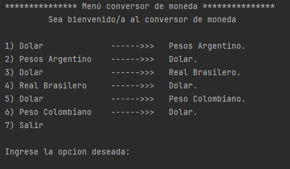
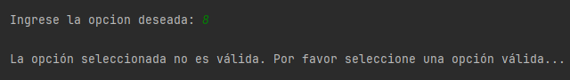
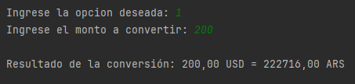

<h1 align="center"> CONVERSOR DE MONEDA </h1>

### Aplicación útil para realizar conversión entre una moneda y otra. Como por ejemplo de "Dolar - USD" a "Peso argentino - ARS"

- ## Uso

La aplicacion tiene un menú con 7 opciones que el usuario puede elegir para realizar la conversión que desee.

Cuando el usurio selecciona una opción la aplicación tiene una serie de validaciones para controlar que el usuario ingrese una opcion válida. Que sea un número y q ese número respete el rango permitido.

La aplicación tambien controla que el monto para convertir sea correcto.

Cuando finalmente el sistema logra pasar todas las validaciones realiza la conversión.

